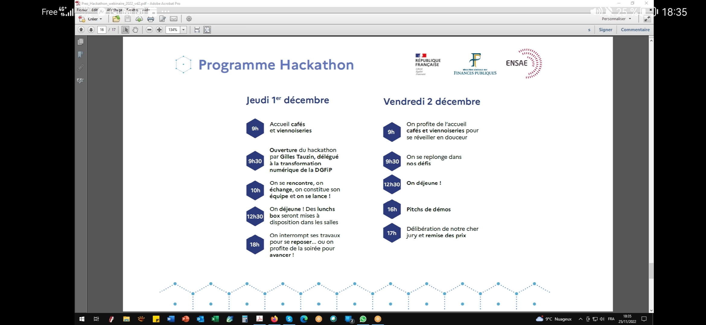

DGFIP = Direction Générale des Finances Publiques
# Emploi du temps

# Technologie de données
## SQL
Voir si ça peut marché en utilisant des identifiants à la place des addresses crypto

## Neo4J
https://graphacademy.neo4j.com/courses/importing-data/  
Semble être apprécié par la DGFiP. Mais à voir comment stocker les données ? (Sur le PC ? sur un Serveur ? Les prix ? avec qui ?)  
**Cypher est le langage de base pour faire les requête**  

Pour faire les requêtes depuis python :  
 - neo4j https://pypi.org/project/neo4j/ 750 stars
 - neomodel https://neomodel.readthedocs.io 772 stars
 - py2neo https://pypi.org/project/py2neo/  1.1K stars

## Dgraph
https://www.youtube.com/watch?v=OzDG68VvPxY  
Aussi une graph database. Utilise GraphQL pour les appels.  
 - pydgraph https://pypi.org/project/pydgraph 248 stars

# Technologie visualisation
## Neo4J
Ils possède une visualisation mais pas beaucoup personnalisable
### neo4jd3
https://github.com/eisman/neo4jd3  
### Popoto.js

### Neovis.js
Impossible a utiliser
https://medium.com/neo4j/graph-visualization-with-neo4j-using-neovis-js-a2ecaaa7c379  
1.2k stars
Utilise directement Neo4J.

## D3JS (Javascript)
104k stars
https://youtu.be/z5erGgXjkHA  
ça semble être la référence pour l'affichage de graph sur les sites Internets. Arguments pour créer un site Internet en local :
 - Technologie stable et universelle donc réutilisable et modifiable dans le futur :
	 - html 1993
	 - javascript 1995
	 - D3JS 2011
 - Possibilité de transformer le site en Logiciel avec Electron JS 2013

## D3Graph (Python)
https://towardsdatascience.com/creating-beautiful-stand-alone-interactive-d3-charts-with-python-804117cb95a7   
Repose sur D3JS, mais semble être moins bien mis à jour que D3JS. Et les schémas semble être moins joli et customisable.  
Avantage : C'est en python  

## Sigma js
10.3k stars