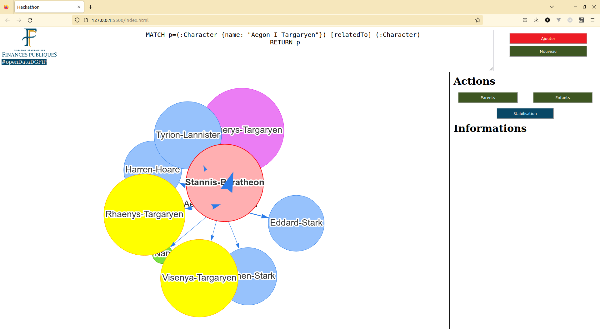

{ width=500px }

# Concept
  
Voici ce que j'ai déjà réalisé avec :   
 - Neo4J  
 - Neovis.js  

{ width=500px }   

Le graphique n'est pas encore super beau, et à part le bouton *nouveau*, rien est utilisable. Mais on part avec une certaine avance en ayant ça.    
Je vous propose donc une répartition des tâches suivantes, comme ça jeudi matin, chacun présentera ce qu'il aura fait, et surtout comment fonctionne la technologie qu'il utilise. Je distribue les tâches en fonction de vos domaines de compétence.

# Répartition des tâches
## 1- Yedidia Python (Pandas) / R / C
En supposant que le csv a pour colonne :  
Adresse expéditeur, Adresse récepteur, Valeur, Date

Créer un nouveau CSV avec  :   
 - balance actuelle des addresses   

OSINT :
 - Blanchiement d'argent : Envoie récurent entre 2 comptes  
 - Listes des comptes des Exchanges et logo  
 - logo des cryptos connues  

## 2- Yann Python -> Neo4J
Installer Neo4J sur un serveur Linux.  
Faire en sorte que le *localhost* soit accessible depuis un autre ordinateur.  
Ajouter Supprimer avec Neo4J Cypher depuis un CSV.  

Ressources :   
 - Movies : https://sandbox.neo4j.com

## 3- Marc Neovis
A quoi correspond *community*, *pagerank* ?  
Faire en sorte que les nœuds soient fixé après déplacement.  

Ressources :  
 - Quickstart Example : https://github.com/neo4j-contrib/neovis.js?#quickstart-example   
 - https://neo4j-contrib.github.io/neovis.js/modules.html   
 

## 4- Kamil Neovis

Double clique permet l'expansion des nœuds. [Comme pour ici](https://eisman.github.io/neo4jd3/).  
Mettre des images ?  
Avoir les infos du nœuds lorsque l'on clique

Ressources :  
 - Quickstart Example : https://github.com/neo4j-contrib/neovis.js?#quickstart-example  
 - https://neo4j-contrib.github.io/neovis.js/modules.html  
 