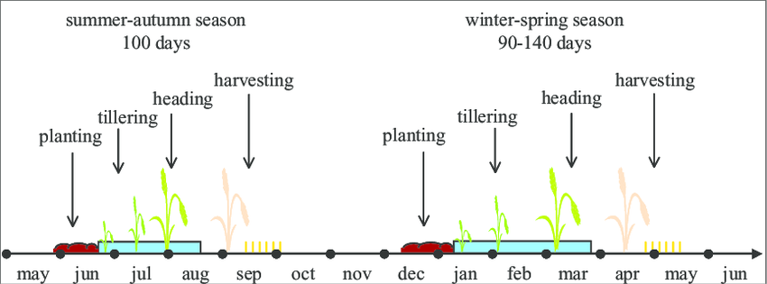

\pagebreak

# Description du problème
## En une phrase
A partir d'un tableau avec les coordonnées d'une parcelle de riziculture et le jour exact de récolte, il faut aller chercher des images satellites pour prédire le rendement de riz sur cette parcelle : `Rice Yield (kg/ha)`.

## Les ressources à disposition
EY nous a mis à disposition des `Jupyter Notebook` expliquant comment aller rechercher les images satellites grâce aux données satellites de Microsoft. EY nous montre également comment filtrer les nuages des images satellites et comment calculer l'Indice de Végétation par Différence Normalisée (NDVI).   

{width=300}  

Il faut noter que les satellites sont dotés de plus d'une vingtaines d'autres capteurs que juste le RGB. EY a utilisé en plus `qa_pixel` pour le filtrage des nuages et `nir08` pour le calcul du NDVI.

## Pistes de résolution
Avec ces ressources, nous avons plusieurs pistes possibles de résolution du problème le premier choix est de partir sur l'idée introduite par EY avec l'analyse du NDVI. En sachant que des valeurs idéales de NDVI tabulées en fonction du temps existent déjà et on pourrait comparer les valeures obtenues à ces données.   

 

Ce choix comporte des inconvénients, car nous ne travaillons plus avec toute l'information disponible, à savoir l'image satellite dans son entièreté mais avec un indice qui provient de cette image. De plus, nous n'avons pas la chance de pouvoir avoir une photo satellite par jour, certaines sont parfois de mauvaise qualité et elles ne sont jamais prises à la même heure, ce qui complique le calcul du NDVI et son traitement. Voici la formule du NDVI :  
$$NDVI = \frac{PIR-R}{PIR+R}$$
avec $PIR$ les canaux proches infrarouges et $R$ les canaux rouges. Nous avons analysé le NDVI sans pouvoir en tirer des informations aussi précises que ce que nous avons fait ensuite avec les réseaux de neurones.
  
  
L'autre choix était donc de repartir de zéro et d'analyser toutes les données à notre disposition, c'est cette piste que nous avions privilégié après avoir analysé le NDVI. 

# Des idées
## La date de récolte
Il faut savoir que la plantation de riz se fait deux fois par an au Vietnam, la première récolte de l'année a lieu en "winter-spring" et la suivante en "summer-autumn".   

 

Cette distinction est également visible dans la base de données des rendements. Il s'avère que la saison, à laquelle la moisson a lieu, détermine grandement la production obtenue.   

{width=450}

Il est claire que la première récolte de l'année "winter-spring" rapporte en moyenne une production plus élevée que en "summer-autumn". En effet, voici les chiffres :   

 - "winter-spring" : $7234.93$ kg/ha en moyenne
 - "summer-autumn" : $5926.69$ kg/ha en moyenne   

## Une explication
Les riziculteurs vietnamiens sont parfaitement conscient de cette écart de récolte entre les deux périodes. Ils appellent la période "winter-spring", ["Vụ Đông Xuân"]{lang=vi} et la période "summer-autumn" ["Vụ Hè Thu"]{lang=vi}.   

C'est parce qu'au Vietnam il y a un climat tropical, avec deux saisons distinctes :   

 - La saison des pluies (mousson) : mai - octobre, avec des précipitations violentes
 - La saison sèche : novembre - avril, plus propice à la riziculture

Ce changement de saison est également à l'origine d'un choix des riziculteurs quant à la sélection de la variété de riz à planter. En effet en "winter-spring" la plupart des riziculteurs vietnamiens plantent du riz Jasmin, mais pour la période "summer-autumn", ils vont préférer d'autres variétés supportant mieux les pluies diluviennes de la mousson mais qui ont un rendement moins élevé.

## Un premier filtrage pour ensuite prédire
Après avoir remarqué cela, il est impossible de ne pas séparer le cas "winter-spring" du cas "summer-autumn". Essayer de faire un modèle qui ne prendrait pas en compte un tel écart serait comme cherche une aiguille dans deux bottes de foin ! Il est pourtant déjà si compliqué de la chercher dans une seule botte...  

{width=200}

Il suffit donc à notre modèle de reconnaître si les images satellites ont étés prises en "winter-spring" ou en "summer-autumn" pour déjà avoir une bonne idée de la bonne réponse.  
Pour faire cette reconnaissance d'image, nous allons utiliser un réseau de neurones conventionnel récurrent.  

**Convolutionnel** : car il va prendre en entrée des images représentés sous forme d'une matrice, avec plusieurs canaux de capteurs différents   

{width=300}  

**Récurrent** : car il ne va pas juste prendre une mais toutes les images du champs depuis la plantation à la moisson et les traiter dans l'ordre chronologique   

{width=300} 

En sortie du modèle, on veut une réponse simple. Est-ce "winter-spring" ou  "summer-autumn" ?  

Pour cela, en plus des canaux `rouge`, `vert`,  `bleu` et `qa_pixel` et `nir08` (déjà présenté auparavant pour le NDVI) nous utilisons également `lwir11` donnant des informations sur la température sur la surface terrestre.   
C'est après cette étape de filtrage que notre modèle est prêt à prédire avec exactitude le rendement d'une parcelle.

# La mise en oeuvre
## Le réseau de neurones
Pour entraîner notre réseau de neurone, nous allons prendre la base de données d'image et pour chaque séquence d'image nous allons comparer ce que le réseau prédit et ce qui était attendu quant à la saison de plantation. En fonction de ces erreurs, nous allons faire de la rétropropagation pour entraîner notre réseau de modèle afin  qu'il ne se trompe plus la prochaine fois. On réalise cela sur une grande quantité de données pour espérer que le réseau de neurones sache généraliser le problème pour que lorsqu'on lui donne en entrée une séquence d'image qu'il n'a jamais vu, il puisse donner la bonne réponse.

## Les difficultés
Tout repose donc sur une grande base de données et l'architecture du réseau de neurones.

### Le problème du vanishing gradient
La disparition du gradient survient lorsqu'on utilise des réseaux de neurones trop profond. L'étape de rétropropagation, donc d'entraînement, n'arrive alors plus à entraîner l'ensemble des couches de réseaux de neurones. L'entraînement ne se réalise pas correctement partout dans le réseau de neurones.   
 
{width=300} 

Pour cela, une méthode inventé en 2015 à l'occasion de la compétition `ImageNET` a été d'utiliser le modèle `ResNET`. C'est également ce modèle que nous avons utilisé, tout en prenant soin d'adapter les couches d'entrée et de sortie à notre problème.   

 

Ainsi, plutôt que de faire la rétropropagation couche par couche, nous ajoutons des blocs résiduels permettant de créer des "raccourcis" afin que l'information ne soit pas dégradée au cours de l'entraînement.

### Un problème de temps et puissance d'apprentissage
Malheureusement nous n'avons pas à la maison des serveurs, des GPU ou des TPU à plusieurs millions d'euros pour entraîner notre réseau de neurones. C'est pourtant bien ce qu'il aurait fallu pour entraîner notre modèle à presque 24 millions de poids.   

{width=300}  

L'idée est d’utiliser le transfert d'apprentissage !  
C'est à dire, comme pour un être humain, utiliser un cerveau déjà performant pour réaliser une tâche similaire et l'adapter pour notre tâche spécifique. En l’occurrence, nous travaillions sur des séquences d'images. Avec le modèle `ResNET`, après plusieurs essais, la solution la moins énergivore a été de prendre la version du modèle entraîné à l'occasion de la compétition `ImageNET` et de faire en sorte que ses paramètres restent constant au cours de l'apprentissage afin de modifier seulement les paramètres d'entré et de sortie de notre réseau de neurones. Ce qui permettra un entraînement plus rapide.    

{width=300}  

### Traiter un problème à la fois
Pour revenir à l'analogie des deux bottes de foin, il fallait d'abord que notre réseau de neurones trouve la saison de plantation à partir des images satellites. Ceci est une résolution de problème de classification. Il est très simple d'évaluer un tel modèle : pour une séquence d'image donnée, soit le réseau de neurone a raison, soit il a tord et donc doit s'adapter. Cette phase d'apprentissage est notre "pré-apprentissage".   
Nous réalisons ensuite un transfert d'apprentissage :) "encore une fois oui". Ce transfert d'apprentissage sert à entraîner le modèle à prédire le rendement des parcelles de riziculture. Cela devient alors un problème de régression linéaire, plus compliqué. Mais du fait de l'utilisation d'un modèle pré-entraîné cette tâche d'apprentissage devient plus simple, plus rapide et moins énergivore.

# Utilité possible de ce projet
Pouvoir prédire le rendement d'une parcelle est très utile. D'autant plus qu'avec notre modèle nous pourrions avoir une idée de la date optimale à laquelle aurait dû avoir lieu la récolte. Ce qui permet aux riziculteurs d'améliorer leur rendement d'une année sur l'autre. Mais également de pouvoir mieux anticiper l'organisation de la récolte.  
Cela permet également la gestion du stockage des récoltes, mais également aux entreprises  gestionnaires et de revente du riz de coordonner la transformation du riz.    

{width=200}

